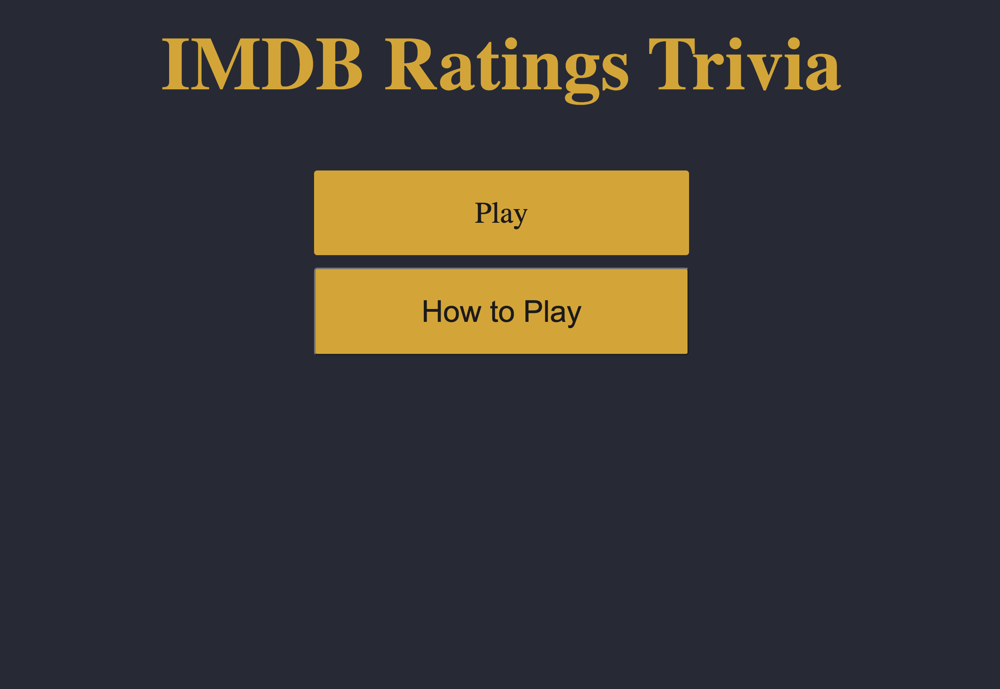
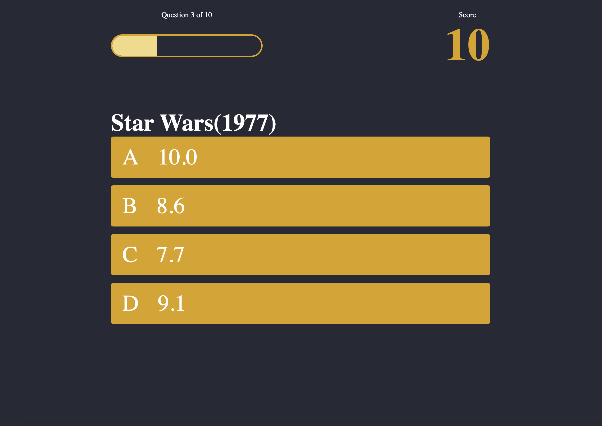

# IMDB: The Rating Game
Hello! Welcome to my first personal project as an aspiring programmer. 
For my first personal project for General Assembly I've made a trivia game with a bit of a twist. 
Are you familiar with IMDB (Internet Movie Database)? Do you love movies? Well this is a game where it puts your love of movies vs the internets in an IMDB ratings game. 

## How to play
The IMDB Trivia Ratings game is pretty straight forward, you'll get a movie as your question, along with 4 movie ratings. Your goal is to guess which rating you think matches the IMDB Rating. If you get it right you'll score 10 points. If you get it wrong it'll move onto the next question.
There are a total of 10 questions to answer, randomized each time. 
See how your movie taste compare to the rest of the internet!

**Link to IMDB Game** [Click Here](https://sergoto.github.io/Project-1/)

### Prerequisite lessons applied
- HTML & CSS
- JavaScript
- HTML DOM

### Wireframes:
- [WireFrame](Images/Project1-Wireframe.png)

### Game Screenshots:

### Why I chose this project and theme:
I chose the Trivia game because of a comment our instructor said that stuck out to me, (and I'm paraphrasing) if I had ups and downs during unit 1, trivia would be a great way to learn more, hone and build on the foundations we've learned this far, which I feel it did. There's still plenty for me to work on and understand, but the project did help me out in better understanding the lessons we've covered in unit 1. 
As for the theme... I just love movies, and I feel I've been on IMDB more than any other site in my lifetime (aside from Google), so I wanted to incorporate that into a project I made. 

### Hurdles:
Hurdles:
- Starting from scratch and figuring out how to make something out of nothing. Sometimes I stuggle with the starting point but once it gets going, I'm able to focus on it.
- Creating a functioning array of questions and answers.
- Getting the questions to display properly if they were correct or incorrect.
- Getting the multiple HTML/CSS pages to work seamlessly.
- Getting the layout and styling to look acceptable
- Getting the question number bar to work and display

### Future Improvements & Stretch Goals:
I had a lot of additonal stretch goals in mind but I wanted to create a working MVP first and as my skills and knowledge improves I hope to add things such as a functioning API which could lead to things as:
- Categories
- Difficulty Choices
- More dynamic UI and options
- Pictures, Images, Logos
- A searchable feature for a movie
- A Scoreboard 
